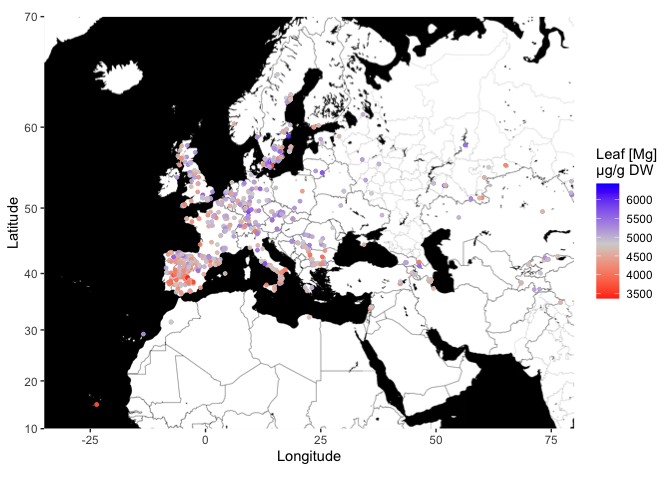

Fig1a
================
Emmanuel Tergemina
2024-03-11

## Load libraries

``` r
library(ggmap)
library(ggrepel)
library(maps)
library(mapproj)
library(plyr)
library(dplyr)
```

## Set map

``` r
Map = c(left = -35, bottom = 10, right = 80, top = 70) #Europe
mapacc <- get_stadiamap(Map, zoom = 5, maptype = c("stamen_toner_background")) #download_map
```

## Import data

``` r
df <- read.table("Fig1a.txt", header = T, sep = '\t')
```

## Plotting

``` r
ggmap(mapacc) +
  labs(x = 'Longitude', y = 'Latitude',color = "Leaf [Mg]\nµg/g DW",shape=3) +
  geom_point(data=df, aes(x = Longitude,y = Latitude, color = Mg25 ),
             size=1,alpha=0.9) +
  scale_colour_gradient2(low = "red",mid = "lightgray",high = "#00AEEF",midpoint = mean(df$Mg25))
```

<!-- -->
