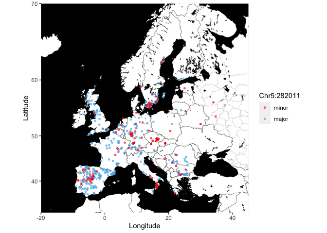

Fig3c
================
Emmanuel Tergemina
2024-03-11

## Load libraries

``` r
library(ggmap)
library(ggrepel)
library(maps)
library(mapproj)
library(plyr)
library(dplyr)
```

## Set map

``` r
Map = c(left = -20, bottom = 32, right = 45, top = 70) #Europe
mapacc <- get_stadiamap(Map, zoom = 5, maptype = c("stamen_toner_background")) #download_map
```

## Import data

``` r
df <- read.table("Fig3c.txt", header = T, sep = '\t')
```

## Plotting

``` r
reorder <- df[order(df$Chr5_282011, decreasing=TRUE), ]
reorder <- reorder%>%filter(Chr5_282011!='.')
ggmap(mapacc) +
  labs(x = 'Longitude', y = 'Latitude',color = "Chr5:282011",shape=3) +
  geom_point(data=reorder, aes(x = Longitude,y = Latitude, color = Chr5_282011 ),
             size=1,alpha=0.6) +
  scale_color_manual(values = c("1" = "#56B4E9","0" = "red"),labels = c("minor", "major"),)
```

<!-- -->
